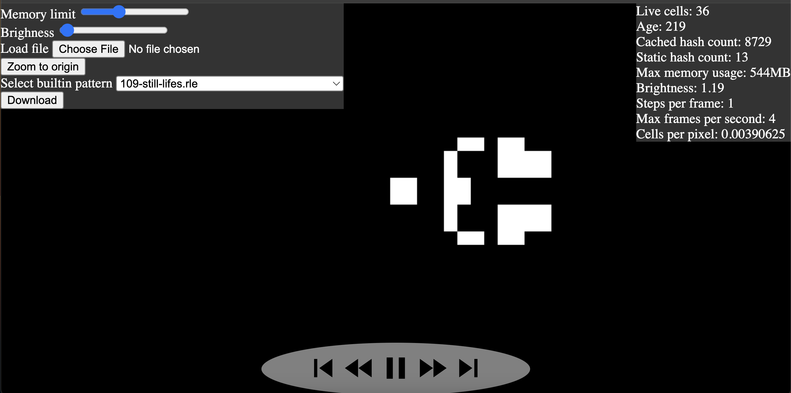
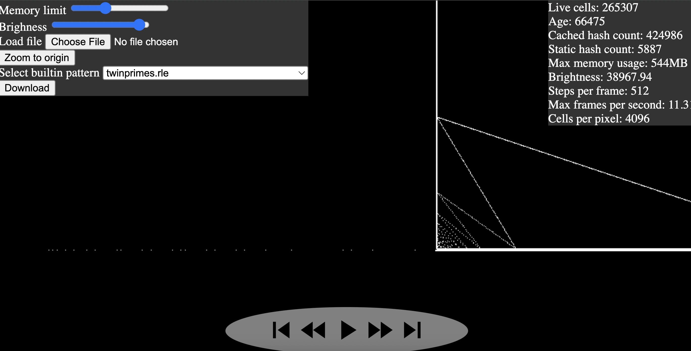

# Hashlife algorithm in Rust in Web browser 

Awhile ago, I wanted to play around with web-centric computing using webassembly and rust. For a project, I picked out the hash-life algorithm, an super-fast algorithm for simulating Conway's Game of life. 

The app looks like this (<a href="https://benblack769.github.io/hashlife-rust/" target="_blank" rel="noopener noreferrer">click to go to deployed demo</a>):

<a href="https://benblack769.github.io/hashlife-rust/" target="_blank" rel="noopener noreferrer">

</a>

To test the full power of the hashlife algorithm, I would recommend:

1. "Select builtin pattern" and selecting either "twinprimes.rle"
2. Pressing both "fast-forward" button and the "skip" button a few times
3. Increasing the brightness to the max
4. Waiting for a few seconds.

You should see the results look something like this:



Note that the dots coming out of the machine correspond one to one with the twin primes! This works because the machine acts like a prime sieve, eliminating all non-primes, and then also eliminating unpaired primes.

* Code here: [https://github.com/benblack769/hashlife-rust](https://github.com/benblack769/hashlife-rust)
* You can learn more about hashlife here: https://www.dev-mind.blog/hashlife/ 


#### Key learnings

* The toolchain for developing wasm and js bindings from rust is pretty mature. I was able to do everything without any trouble. 
* It is easiest to start out without build tooling, and add that it later if you need to plug it into a larger project.
* Remember that webassembly doesn't have great support for garbage collection. Programming in rust helps with this.
* It is fun to implement an algorithm like this without frameworks


### Development

While this repo is not looking for any contributions and is feature frozen, if you want to fork it and add your own cool features, here is how to build it.

#### Install dependencies

1. Install [`cargo`](https://www.rust-lang.org/tools/install) (rust build tools)
2. Install [`wasm-pack`](https://github.com/rustwasm/wasm-pack) (rust-wasm interface builder)

#### Build

```
cd wasm-hashlife
wasm-pack build --release --target web
cd ..
cp wasm-hashlife/pkg/wasm_hashlife* frontend/
```

#### View locally

```
cd frontend
python -m http.server
```
View on [http://localhost:8000/](http://localhost:8000/). Enjoy!